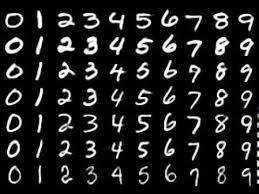
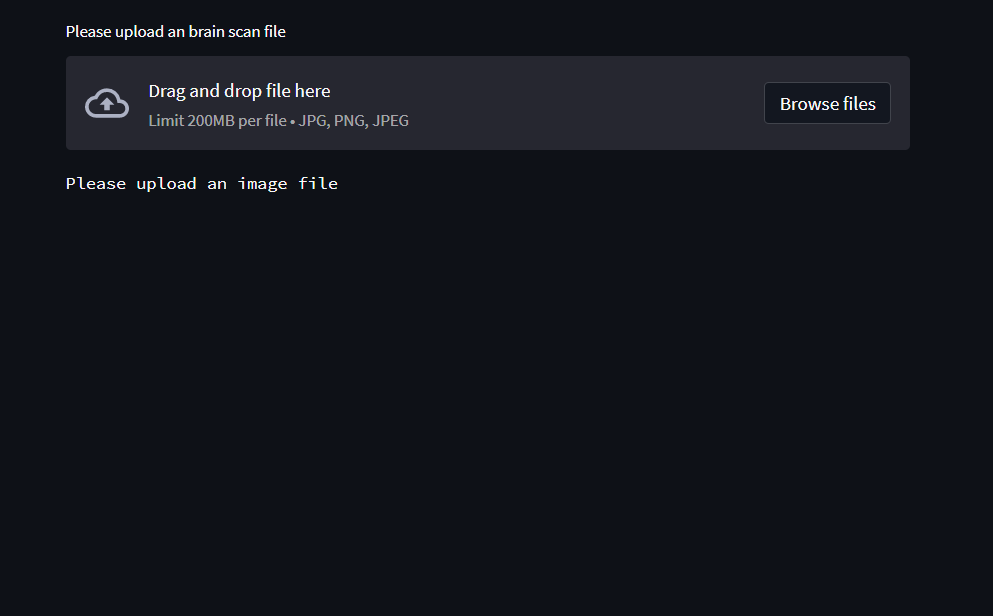
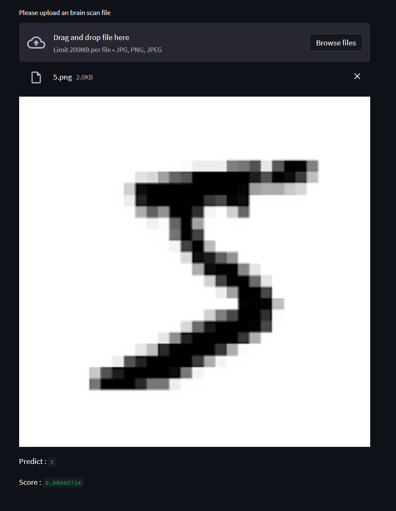

# MNIST
The [MNIST](https://keras.io/examples/vision/mnist_convnet/) database of handwritten digits, available from this page, has a training set of 60,000 examples, and a test set of 10,000
examples. It is a subset of a larger set available from NIST. The digits have been size-normalized and centered in a fixed-size image

## Clone recursively
``` shell
git clone https://github.com/yahyoxonqwe/MNIST.git
```
## Enter this file
``` shell
cd cifar10
```
## Install Virtual environment
To use the MNIST dataset, it is recommended to create a virtual environment in Python. You can do this by using the virtualenv package. First, install virtualenv using pip:
``` shell
python -m pip install --user virtualenv
```
## give a name this environment
``` shell
python -m venv your_env
```
## Activate this environment
``` shell
your_env\Scripts\activate.bat
```
## Install requirements
``` shell
pip install -r requirement.txt
```
## Open jupyter notebook
``` shell
jupyter notebook
```
## Run streamlit
``` shell
streamlit run streamlit.py
```


## Predict

